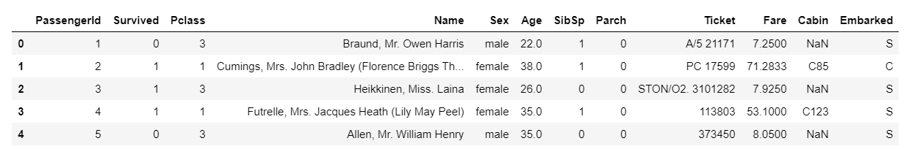
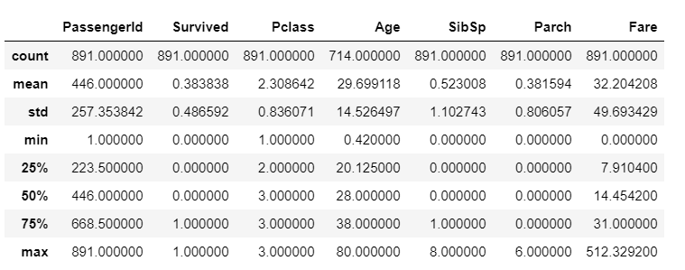
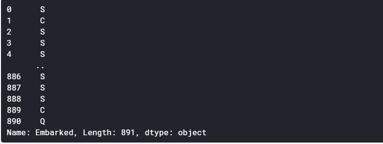
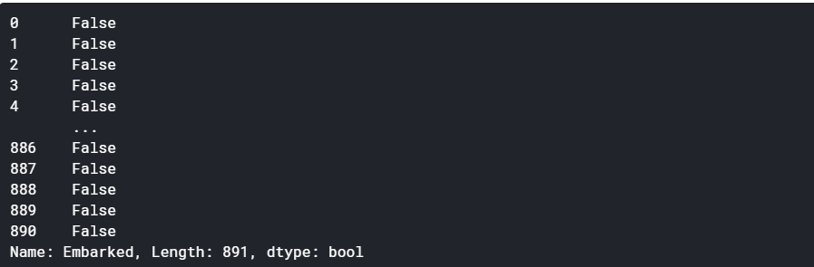
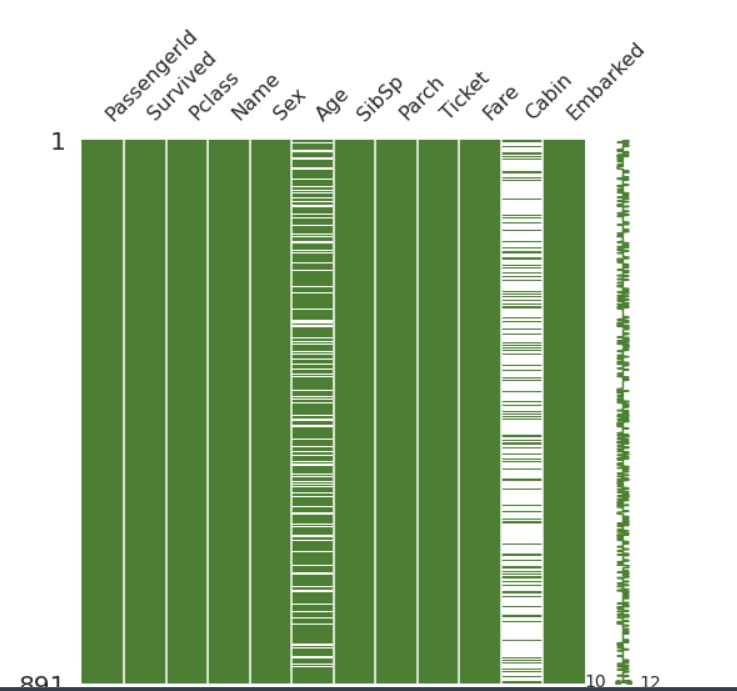
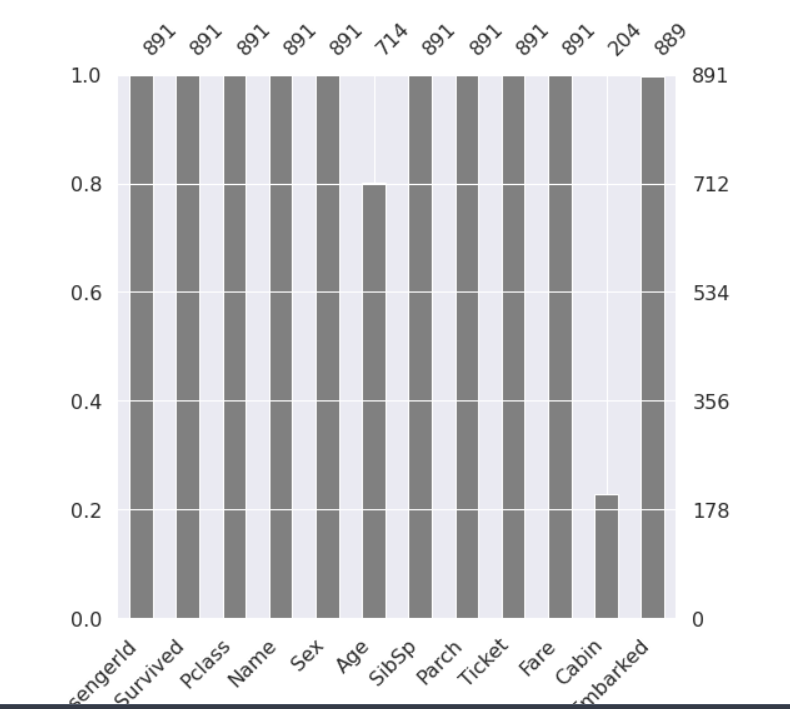

# Kaggle Titanic Pjt -1

:punch: 들어가기 앞서

### 3월 16일 Kaggle 첫 시작

때는, 3월 15일 새벽 삼성전자 공채 시작을 보고 여태까지 막연하게 아! 나는 평분가고싶다! 라고 했었는데, 막상 자소서를 쓰려니까 여태까지 내가 했다고 어필했던 데이터 역량을 검증할 수 있는게 진짜 하나도 없다는 걸 느꼈다. 그래서, 기왕 ssafy로 코딩의 세계에 발을 들여놓은김에 상반기를 스킵하고 기초적인 데이터 분석 역량을 쌓아볼까 생각하게 되서 다급하게 나의 ssafy은사님,, 종백님께 도움을 요청했다! ;ㅂ; 진짜 늦은시간에도 너무 자세히 상세하게 알려주셔서 새로운 목표를 가지고 시작하게 되었다! 
나의 첫번째 미션은 바로 kaggle로 타이타닉 프로젝트. 진짜 나는 배경지식이 0라서 pandas,,? numpy,,? 다 처음듣는 라이브러리와 용어들의 파티지만 와 진짜 강의 하나 들었는데 너무 재밌었다..
일단 생각보다 로직들이 그렇게 어렵지 않고, 내가 배운것들이 사용되는거를 직접 확인한다는 것은 
언제나 짜릿해! 늘 새로워! 
이번주는 삼성 자소서도 작성해야하고, 할게 조금 많아서 이렇게 쥬피터 노트북으로 업로드 할 예정이다. 그리구, 30분 밖에 안되는 강의지만 우선은 하루에 하나씩, 주말에 시간나면 여러개 들으면서 공부해야겠다. 담주부터는 블로그에 업로드 해봐야지 ! ;ㅂ; 
우선, 모든 코드들은 You Han Lee님의 '캐글 타이타닉'을 그냥 카피하면서 배운 내용들이다! 

### :closed_book: library 설정

```python
import numpy as np
import pandas as pd
import matplotlib.pyplot as plt
import seaborn as sns 

plt.style.use('seaborn') #matplotlib의 스타일을 seaborn으로 설정하고
sns.set(font_size = 2.5) #font사이즈를 다 2,5로 해준다.
```

`numpy` : 수치해석적으로 할 수 있는 연산들을 도와주는 library

`pandas`: sql처럼 dataframe을 다룰 수 있는 함수들을 제공해주는 library

`matplotlib`, `seaborn` : 데이터를 시각화 하는데 사용

### :computer: Data Set 확인

데이터가 어떻게 이루어져 있는지, null data가 있는지를 확인하는 과정이다. 내가 분석할 데이터를 아는게 가장 중요하겠지!!? 그래서 매우 중요한 과정이다. 우리가 사용할 kaggle은 data를 제공해주는데, 상대 경로를 사용하였다.

##### :heavy_check_mark: python 상대 경로 & 디렉토리 확인

이거 진챠 나 계속 헷갈리는 건데 (왜냐구? 정리를 안하니께~) 이번에도 강의의 코드랑, 내가 사용한 버젼이랑 2년정도의 차이가 있어서 인지 데이터 위치가 달라서 처음에 에러가 발생했었다!

`.` : 현재 위치를 나타냄

`..` : 바로 상위 폴더 => 더 위로갈수록 .이 증가한다

```python
#현재 경로 출력하기
import os
print(os.getcwd())
```

##### :ship: Titanic data 

여기서 데이터를 보는데 사용하는 함수들은 대부분 pandas :panda_face:의 함수인것 같다 (아니라면 머쓱;;)

1. data를 객체에 저장

```python
df_train = pd.read_csv('../input/titanic/train.csv')
df_test = pd.read_csv('../input/titanic/test.csv')
```

내 현재 위치는 `output/kaggle/working` 이였다. 영상의 경로는 `../input/train.csv`였는데 아무래도 titanic이라는 큰 폴더가 하나 더 생성된 것 같다.

2. `head`로 초반 데이터 보기

```python
df_train.head()
```



`head()`함수는 default로 dataset의 처음 5개를 보여준다. 이 때, `head(10)`처럼 개수를 지정해주면 그만큼 보여줌!


3. `describe()` 로 각 객체의 통계적 수치를 보여준다

```python
df_train.describe()
```



4. `shape`으로 dataset의 차원 알기 :star: 

```python
df_train.shape
>> (891,12)
```

머신러닝에서 행렬의 차원을 shape이라는 개념으로 표현한다. 이 함수를 사용했을 때, 결국 (행의 크기, 열의 크기)를 알려준다!


##### :zero: Null data 파악하기

앞서서 describe함수를 적용한 값에서 `count`를 보면, `Age`의 값이 확연히 다른 값을 가짐을 알 수 있다. 이 의미는, age에 null data가 존재한다는 뜻 ! 우리는 파이썬 문법을 활용해서 더욱 수치적으로 null data의 비율을 알아내자.

우선, 이코드를 하나하나 배우면서 감탄했다,,우와,, 이렇게 코드를 짜는거구나,, 간단하지만 뭔가 엄청 감명깊었다

```python
for col in df_test.columns:
    msg = 'column: {:>10}\t Percent of NaN value: {:.2f}'.format(col, 100*(df_test[col].isnull().sum() / df_test[col].shape[0]))
```

1. `df_test[col]` 

   위 코드를 적용하면 pandas의 기본 data 형태인 **series**형으로 데이터를 반환한다. 그런데, 이 series형식은

   index와 value로 이루어진 값이다! 아래사진에서는 아마 마지막 col이 Embarked라서 그 data로 나온듯!

   

2. `.isnull()` 

   data가 null이면 True를 반환하고, 아니면 False를 반환한다. 

   ```python
   df_test[col].isnull()
   ```

   

3. `sum()`으로 null data 개수 구하기

   :clap: 와 여기서 감명받았닼ㅋㅋㅋㅋ어떻게 bool값으로 전체 합을 구해서, 그거를 빈 데이터 개수를 파악하는 생각으로 이루어지지,,? 물론 내가 진짜 아무것도 몰라서 감명깊은거일수도 있지만, 그냥 이런 생각을 할 수 있는거 자체가 진짜 감명깊었다.. 나였으면 고냥 반복문 조지게 돌려서 cnt로 세고있었겠지,,?

   ```python
   df_train[col].isnull().sum()
   >>> 2
   ```

   여기서 2가 반환되는 것은 결국 true 값이 2개. 즉, 빈데이터가 2개 있다는 의미다.

4. null data 전체 비율 구하기

   `df_train[col].shape[0]` 이걸 사용해서 전체 데이터 개수를 받는다,, 브라보,, shape은 (행,열) 데이터니까 행의 크기를 알고 싶은 우리는 [0] 인덱스로 구해온다.

   :pizza: 여기서 엄청난 꿀팁..

   그 칸?을 누른상태로 `esc`하고 `f`를 누르면 검색이 가능한데, 거기서 keyword를 다른 keyword로 바로 바궈줌,,,개쩌러,,

   

#### :bar_chart: Data 도식화

```python
msno.matrix(df=df_train.iloc[:, :], figsize=(8,8), color=(0.3, 0.5, 0.2))
```



`matrix` 는 matrix로 만들어주는데

`df=df_train.iloc[:, :]` 

data frame에 df_train을 넘겨준다. `iloc`은 index location으로 slicing 해주는 것!

[:, :]는 모든 데이터를 가져온다.

​	:heavy_plus_sign: `iloc` 사실아직 잘 모르겠슴 ^^~

 - `df_train.iloc[:, :5]`

   처음 데이터 부터 idx=5까지의 데이터를 불러온다

- `df_train.iloc[:, 6:]`

  6번데이터 부터 끝까지 가져온다..

`figsize` : 말그대로 figure의 크기!

`color`은 r,g,b로 이루어져있고 각 항목은 0~1사이의 값을 가진다.

```python
msbo.bar(df=df_train.iloc[:, :], figsize=(8,8), color=(0.5,0.5,0.5))
```



이렇게 bar로도 나타낼 수 있다.

:eyes: 보다시피 어떻게 나타내냐에 따라서 데이터 파악되는 정보가 좀 다르다! 잘 생각하고 선택해야 될듯!