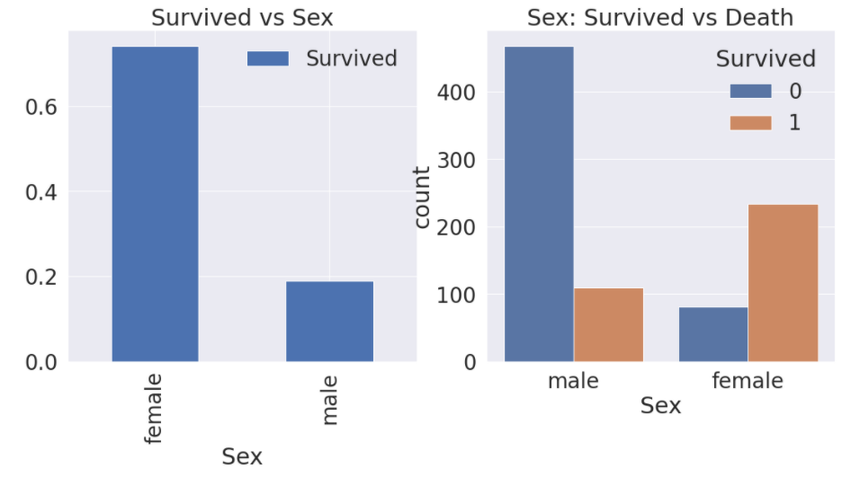
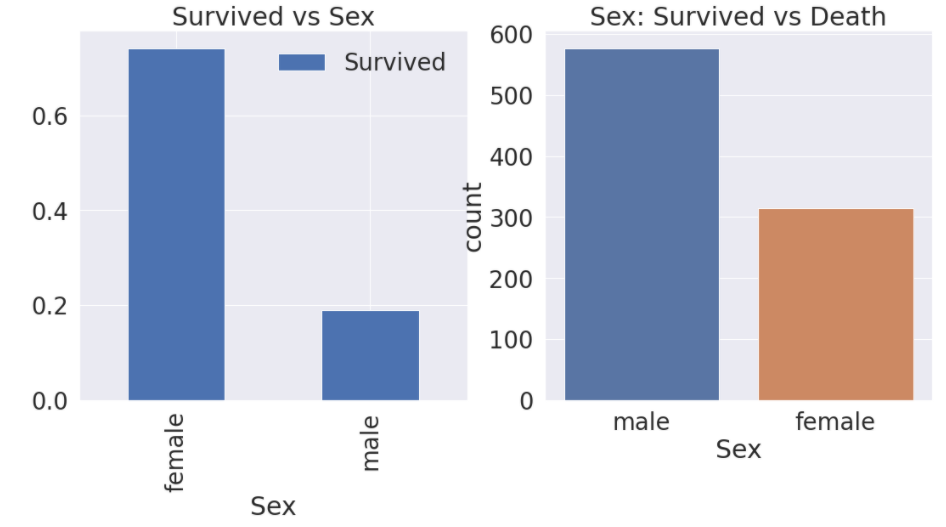
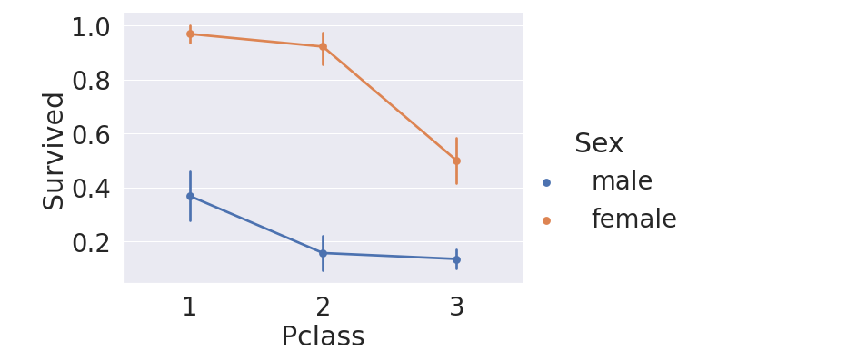
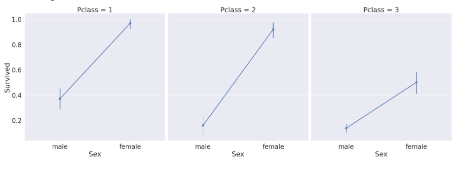
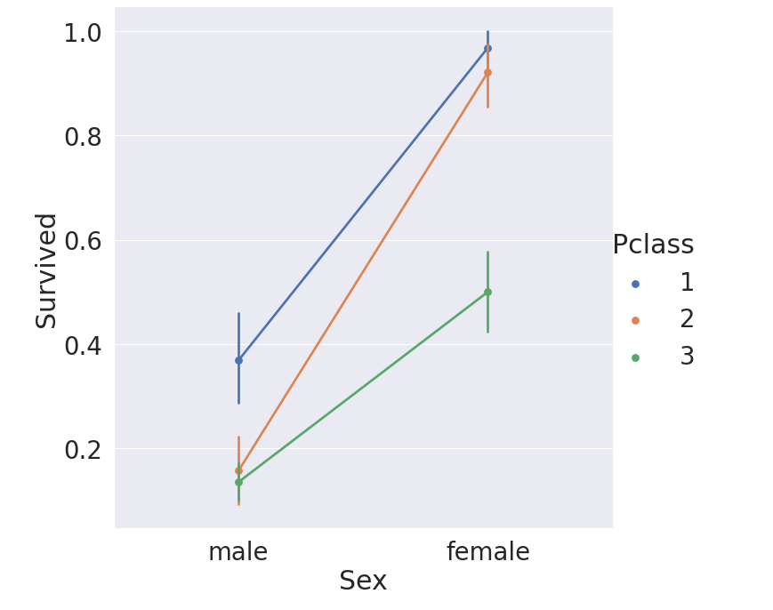

# EDA 2 

## 2.2 Sex

성별에 따라서 생존율이 어떻게 달라지는지를 알아보자!

```python
f, ax = plt.subplots(1,2,figsize=(18,8))
df_train[['Sex','Survived']].groupby(['Sex'],as_index=True).mean().plot.bar(ax=ax[0])
ax[0].set_title('Survived vs Sex')
sns.countplot('Sex',hue='Survived', data=df_train, ax=ax[1])
ax[1].set_title('Sex: Survived vs Death')
plt.show()
```



우선 그래프를 작성하는 방법은 동일하다. 그런데 지난번 EDA에서 내가 `hue`가 색상을 구분하는 역할 같다고 생각했는데. 맞긴한데, 정확히말해서 `hue`에 지정해준 카테고리 별로 색상을 다르게 해준다. 즉 우리는 `hue='Survived'`이므로, 각각의 성별에서 또 생존카테고리에 따라서 색갈이 다르게 나타낼 수 있는거다!

:frog: hue를 사용안할경우 => 이렇게 구분이 안되는걸 알 수 있다!



- 생존율 수치 구하기

  ```python
  df_train[['Sex','Survived']].groupby(['Sex'], as_index=False).mean()
  ```

  |      | Sex    | Survived |
  | ---- | ------ | -------- |
  | 0    | Female | 0.742038 |
  | 1    | male   | 0.188908 |

  생존율을 수치로 정확하게 구한다면 **여자의 생존율이 0.74**로 굉장히 높다는 걸 알 수 있다.. 차이가 엄청 심하다!

### 2.2 Both Sex and Pclass

이제 성별과, 좌석 등급가 생존율에 영향을 얼마나 미치는지 알아보자. 이렇게 3개 이상의 인자를 나타낼 경우 `factorplot`을 사용한다.

```python
sns.factorplot('Pclass','Survived',hue='Sex', data=df_train, szie=6, aspect=1.5)
```



- 다른 방식으로 나타내기

  x축을 성별로 하여서 데이터를 나타내보자

```python
sns.factorplot(x='Sex', y='Survived', col='Pclass', data=df_train , saturation=5,size=9,aspect=1)
```



동일 class내에서 성별에 따른 생존율 차이를 확인할 수 있다.

여기서는, `col`을 `hue`대신에 사용했다. `col`의 경우, 지정해준 category별로 그래프를 새로 생성하고, hue는 한 그래프에서 색상을 구분해주는 역할을 하는 것 같다

```python
sns.factorplot(x='Sex', y='Survived', hue='Pclass', data=df_train , saturation=5,size=9,aspect=1)
```




+ y축방향의 세로 선은 `error bar`라고 한다. 길이가 길수록 신뢰도가 낮다는 의미!

##### :star: 최종 결론

남,녀 성별 상관없이 우선 class가 높을 수록 생존율이 매우 높아진다. 특히 여자의 경우 1-2class는 생존율이 90%에 육박한다. 이를 통해 우리가 알 수 있는 결론은..

1. Lady first :woman:
2. Money brings survival :euro:

