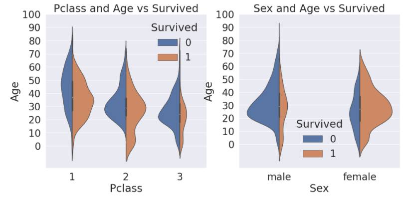
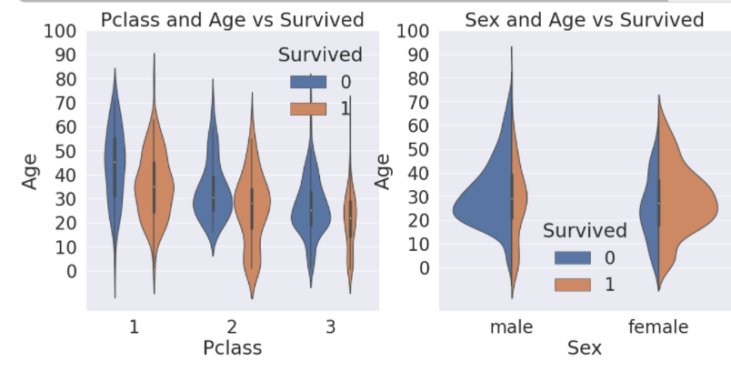
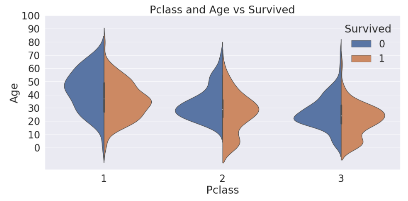
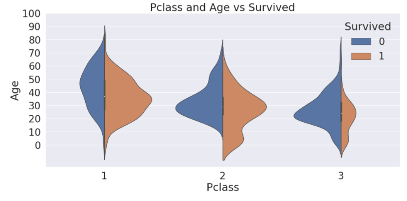

# 04-2 EDA Age, Sex, Pclass

> 3차원 data를 plot하는 것은 다양하지만 여기서 우리는 :violin: violin plot을 사용한다

x축에는 우리가 구분해서 보고싶어하는 case인 (Pclass, Sex)이고, 그에따른 나이 분포를 y축으로 설정하고 hue는 생존율로 주어준다.

```python
f,ax = plt.subplots(1,2,figsize=(18,8))
sns.violinplot('Pclass','Age', hue='Survived', data=df_train, scale='count', split=True, ax=ax[0])
ax[0].set_title('Pclass and Age vs Survived')
ax[0].set_yticks(range(0,110,10))

sns.violinplot('Sex','Age',hue='Survived',data=df_train, scale='count',split=True, ax=ax[1])
ax[1].set_title('Sex and Age vs Survived')
ax[1].set_yticks(range(0,110,10))
plt.show()
```



좌측 그래프를 통해서, 확실히 class에 따른 나이 분포차이를 알 수 있고, 생존자의 분포도 알 수 있다. 우측 그래프에서는 성별에 따라서, 즉 여성일 경우 생존율이 훨~~~씬 높다는 것을 알 수 있다.


#### 왜 violin plot이지? (split=False)

```python
f,ax = plt.subplots(1,2,figsize=(18,8))
sns.violinplot('Pclass','Age', hue='Survived', data=df_train, scale='count', split=False, ax=ax[0])
ax[0].set_title('Pclass and Age vs Survived')
ax[0].set_yticks(range(0,110,10))

sns.violinplot('Sex','Age',hue='Survived',data=df_train, scale='count',split=True, ax=ax[1])
ax[1].set_title('Sex and Age vs Survived')
ax[1].set_yticks(range(0,110,10))
plt.show()
```



좌측의 그래프를 보면, `split=False`로 주게되었는데, 이경우에는 똑같으 데이터가 대칭모양으로 생겨서 마치 violin :violin: 모양 같다고 해서 붙여진 이름이란다!

#### 다양한 scale method

```python
f,ax = plt.subplots(1,1,figsize=(18,8))
sns.violinplot('Pclass','Age', hue='Survived', data=df_train, scale='area', split=True)
ax.set_title('Pclass and Age vs Survived')
ax.set_yticks(range(0,110,10)) #나이 범위를 주고, 10단위로 끊기게 하였다

plt.show()
#area를 사용하면, 0과 1의 분포 차이는 확연하게 나타난다 ( 면적이 동일하게 제공되니까) 하지만, 개별 개수의 차이를 알기는 어렵다
#count를 사용하게 되면, 개수에 대한 분포를 확실히 알 수 있다.
```

:maple_leaf: `scale = area`

area를 사용하게 될 경우, 양쪽의 violin은 모두 같은 넓이를 가지게 된다. 즉 정확한 개수파악은 어렵고, 생존률에 따른 분포차이를 확연하게 비교할 수 있다!



:raised_hand_with_fingers_splayed: `scale = count`

우리가 기존에 사용했던 `count`의 경우는, data의 개수를 반영해서 나타내기 때문에, 실제 data의 수를 파악하는데 더욱 용이하다.



=> 1 class에서 생존자가 더 적다는 것을 알 수 있지~~

### 여성과, 아이를 우선적으로 챙겨서 생존율이 높은 것으로 추측할 수 있다. 

