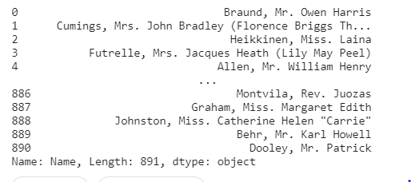
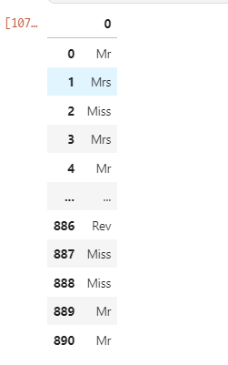
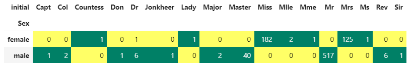
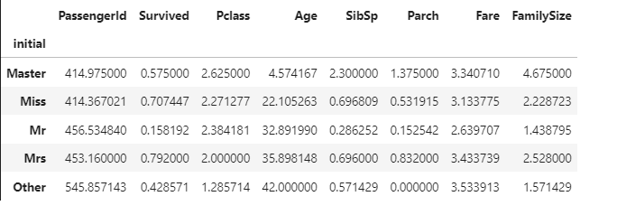
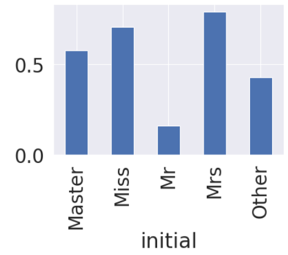
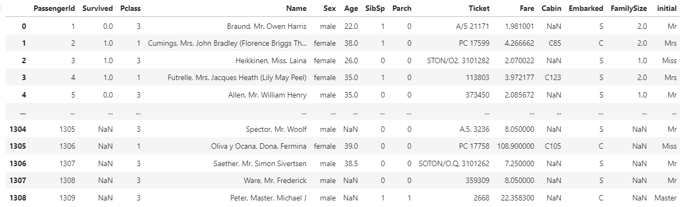
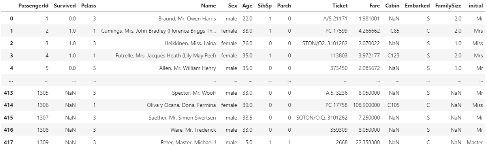
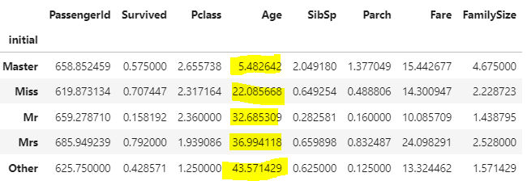
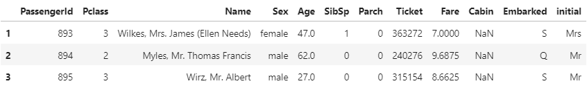
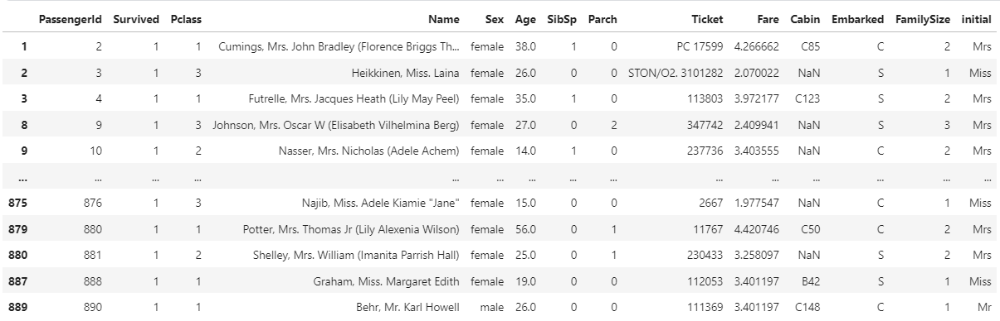

# 09 - Feature Engineering - Fill Age Null data

> 호오,,진짜 배운거? 신기한게 많았다 이제 EDA를 끝내고 예측 모델 생성을 들어간다. 진짜 오래걸렸다 농땡이 피우는 성격 + 쌒희 + 취준 겹치면서 아몰랑~~ 하면서 너무 질질 끌어버렸당 데헷,,, 이거 이번주에 끝내고 복습하고 DACON 반도체 박막 데이터 분석혼자 해봐야겠다...

:pray: https://kaggle-kr.tistory.com/18?category=868316 다시한번 최고의 강의에 감사드리며,, 

## Fill Null using title

우선, null data를 채워야 한다. 이 채우는 과정에서도 통계적 수치를 이용해서 채워주어야한다. 이 값을 어떻게 채우냐에 따라서 우리가 만드는 모델의 성능이 크게 달라진다고 한다. 가장 먼저, 제일 비어있는 Age부터 채워보도록 하자. 

```python
df_train['Age'].isnull().sum()
```

Age 항목의 빈 데이타 갯수를 먼저 다시 확인하자. 177개이다.

```python
df_train['Name']
```



우리는 Age를 채우면서 'Name', 즉 이름에 의한 통계를 활용해서 채우도록 한다. 이름을 확인해보면 Mr, Mrs와 같이 `Initial.Name` 의 구조로 Last Name이 이루어져있는 것을 알 수 있다.

:star: 정규 표현식을 통해서 Name을 분리해보자.

**정규 표현식**: 특정한 규칙을 가진 문자열을 나타내는데 사용하며, **pandas** :panda_face: 에서는 **extract**를 사용한다. 

```python
df_train['Name'].str.extract('([A-Za-z]+)\.')
```

`.str`은 pandas에서 data를 string으로 변환해주는 method이다.

`[A-Za-z]` 알파벳의 범위를 지정해주고, `+` 이 범위중에 한개이상으로 이루어져있으며, `.` 으로 구분해준다는 의미? 같다



처음에 작성할때 `([A-Za-z]+\ .)` 의 구조로 작성했더니 `.` 이 포함된 상태로 나뉘어졌다. 그렇지 않게 하기 위해 조심!

이제 이 구분한것을 `initial`이란 column에 저장해준다.

```python
df_train['initial'] = df_train['Name'].str.extract('([A-Za-z]+)\.')
df_test['initial'] = df_test['Name'].str.extract('([A-Za-z]+)\.')
```


#### :badminton: Initial 별 성별 파악

`crosstab`을 이용하여, 쉽게 각 Initial별의 성별이 어떻게 이루어져있는지 알아보자

```python
pd.crosstab(df_train['initial'],df_train['Sex']).T.style.background_gradient(cmap='summer_r')
```



여기서 강의와 조금 다른게 있는데, `Mlle`과 같은거는 마드모아젤의 약어라고 하고, `Jonkheer`의 경우에는 귀족중에서 가장 낮은 신분..?을 의미한다고 한다 = 성별과 상관없는거? 그래서 강의에서는 이 Jonkheer을 `Other`이라고 하셨는데 나는 처음에는 단순하게 성비만 보고 그냥 Mr라고 설정했는데 지금보니 다 의미가 있구나 ^^,, 그리고 Dr를 Mr로 설정하셨는데, 난 그냥 성비가 섞여있는 Initial은 Other로 통일하였다. 

- Countess : 백작
- Jonkheer : 귀족내에서 가장 낮은 직급
- Rev : 신부님

이제 우리는 initial column을 다시 치환시켜줘야 하는데 `replace` 메소드를 사용해준다. 

```python
df_train['initial'].replace(['Capt','Col','Countess','Don','Dr','Jonkheer','Lady','Major','Mlle','Mme','Rev','Sir','Ms'],['Mr','Mr','Miss','Mr','Other','Mr','Miss','Mr','Miss','Miss','Mr','Mr','Miss'],inplace=True)
```

```python
df_train.groupby('initial').mean()
```

initial로 묶어서 수치를 나타내주면



요렇게 다 통일되었단 것을 확인할 수 있다! test data도 동일하게 진행하는데, test에는 `Dona`라는 이니셜이 추가로 존재하므로 그것바꿔주면 된다!

:comet: 여기서 새로 안 사실! `Master`은 5살 미만의 남자아이를 존칭으로 불러주는 호칭이라고 한다( Age의 평균을 통해서도 확인 가능), 그런데 그냥 어린아이로 통일!

#### :leaves: Initial 별 생존율

```python
df_train.groupby('initial')['Survived'].mean().plot.bar()
```



우리가 EDA 에서도 파악했듯이, 여자와 관련된 이니셜(Mrs, Miss)의 생존율이 매우 높고, 어린아이의 생존율도 높은 것을 확인할 수 있다. 


### Null data 채우기

pandas의 **concat**을 통해 train 데이타와 test데이타를 합친다. 그냥 concat을 하게 되면, index가 자동으로 정렬되는게 아니라 말 그대로 그냥 다른 데이터 뒤에 이어 붙이는,.? 형식이 되므로 `reset_index(drop=True)` 를 사용하면, index가 이어지게 된다.

```python
df_all = pd.concat([df_train,df_test])
df_all.reset_index(drop=True)
```



- reset_index 안할 경우

  

이제 전체 데이터의 initial을 기준으로 모든 col의 평균 값을 구해보자

```python
df_all.groupby('initial').mean()
```



색칠해 놓은 평균값들을 반올림해서 넣어줄거다!

#### location

pandas에서 location을 활용하여 우리가 원하는 row, col을 반환할 수 있다.

`[row,col]` 의 형태로 사용한다. 숫자로 index를 설정하거나, boolean값으로 데이터를 얻을 수 도 있다 

```python
df_train.loc[0, :]
```

=> 1번째 row의 모든 col을 보여주세요 라는 의미

```python
df_test.loc[1:3,:]
```

2번째 row~4번째 row의 모든 col을 보여주세요



```python
df_train.loc[df_train['Survived']==1]
```

생존한 사람들의 데이터만 가져와주세요라는 의미




이제, 이걸 활용해서 Initial별 Age null data를 채워주자

```python
df_train.loc[(df_train['Age'].isnull())& (df_train['initial']=='Mr'),'Age']
```

`(df_train['Age'].isnull())` Age의 값이 없는 애들

`df_train['initial']=='Mr'` 이니셜이 Mr인 애들

의 교집합 `&` 중에서, `Age` col을 보여주세요 라는 코드이다.

이제 여기에, Mr의 평균 나이인 33세를 입력해주자

```python
df_train.loc[(df_train['Age'].isnull()) & (df_train['initial']=='Mr'),'Age'] = 33
```


나머지도 동일하게!

```python
df_train.loc[(df_train['Age'].isnull()) & (df_train['initial']=='Master'),'Age'] = 5
df_train.loc[(df_train['Age'].isnull()) & (df_train['initial']=='Mrs'),'Age'] = 37
df_train.loc[(df_train['Age'].isnull()) & (df_train['initial']=='Miss'),'Age'] = 22
df_train.loc[(df_train['Age'].isnull()) & (df_train['initial']=='Other'),'Age'] = 44

df_test.loc[(df_test['Age'].isnull()) & (df_test['initial']=='Mr'),'Age'] = 33
df_test.loc[(df_test['Age'].isnull()) & (df_test['initial']=='Master'),'Age'] = 5
df_test.loc[(df_test['Age'].isnull()) & (df_test['initial']=='Mrs'),'Age'] = 37
df_test.loc[(df_test['Age'].isnull()) & (df_test['initial']=='Miss'),'Age'] = 22
df_test.loc[(df_test['Age'].isnull()) & (df_test['initial']=='Other'),'Age'] = 44
```


```python
df_train['Age'].isnull().sum
```

이 값이 0임을 통해, 모든 age의 데이터가 채워졌음을 알 수 있다!!!