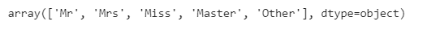
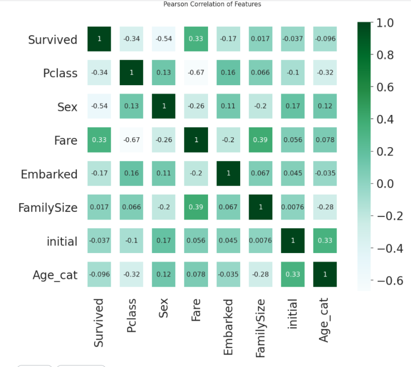

# 11. Feature Engineering - Change String to Numerical

> 우리가 만든 Initial feature와 같이 string으로 이루어진 건, 학습시킬때 좋지않다. 고유의 숫자값으로 변환해서 적용시켜줘야 한다!

우선, 각 feature에 어떠한 특수한 값이 있는지 (정말 어떤 값으로 이루어져 있는지)를 구할때는 `unique()`를 통해서 구할 수 있다. 혹은, `value_counts()`로 각 항목이 몇개 있는지 까지 알 수 있다. 

### Initial

```python
df_train.initial.unique()
```



initial의 feature에는 다음과 같은 값으로 이루어져있는 것을 확인할 수 있다. 

데이터를 바꿔주는 방법은 직접 하나하나 대입해주는 하드코딩, `map`을 이용해서 한번에 바꿔주는 방법이 있다.

- 하나씩 직접 바꿔주는 방법

  ```python
  df_train.loc[df_train['initial'] == 'Master','initial'] = 1
  ```

- map 사용하기

  ```python
  df_train['initial']=df_train['initial'].map({'Master':0, 'Miss':1, 'Mr':2, 'Mrs':3, 'Other':4})
  df_test['initial']=df_test['initial'].map({'Master':0, 'Miss':1, 'Mr':2, 'Mrs':3, 'Other':4})
  ```

  

### Embarked

Embarked역시 unique() method를 통해서 값을 확인해보면 `S,C,Q`의 값으로 이루어져있는 것을 알 수 있다. 

```python
df_train['Embarked'] = df_train['Embarked'].map({'C':0,'Q':1,'S':2})
df_test['Embarked'] = df_test['Embarked'].map({'C':0,'Q':1,'S':2})
```


### Sex

sex역시 `female, male`의 string 값으로 이루어져있다.

```python
df_train['Sex'] = df_train['Sex'].map({'female':0,'male':1})
df_test['Sex'] = df_test['Sex'].map({'female':0,'male':1})
```


## Feature간 관계 구하기 :star:

각각의 상관관계를 구하기위해 (비례, 반비례) `Pearson Correaltion`를 사용해보자.

#### Pearson Correlation

두 변수 간의 선형 상관관계를 나타낸다. (-1,1)의 값을 가지며, 0은 상관관계가 없음. -1은 반비례, 1은 완벽한 상관 관계를 가짐을 나타낸다. 


우리는 구성하는 feature가 많기 때문에 matrix로 나타내면 편할것이다. 그걸 해주는게 **heatmap**

```python
heatmap_data = df_train[['Survived','Pclass','Sex','Fare','Embarked','FamilySize','initial','Age_cat']]
```

```python
colormap = plt.cm.BuGn # color 모음집
plt.figure(figsize=(14,12))
plt.title('Pearson Correlation of Features',y=1.05, size=15)
sns.heatmap(heatmap_data.astype(float).corr(), linewidths=20,vmax=1,
           square=False, cmap=colormap, linecolor='white',annot=True, annot_kws={'size':16})
```

pandas의 `corr()` method를 통해 상관관계를 계산하고, seaborn으로 나타낼 수 있다.  `annot`는 수치값을 보여지게 할지를 결정하며, `annot_kws`를 통해 숫자의 사이즈를 나타낸다. 이때 `annot_kws={'size':16, fmt='.2f'}` 처럼 format을 설정해주면, 소수점 숫자를 지정해준다.




#### heatmap 읽기

x축에서 원하는 feature를 정하고 세로축에서 다른 feature를 정하면 된다. 

숫자가 작을 수록 관계가 없다는 것을 나타냄! 그리고 이걸 통해서 선형 관계인 애들은, 추후에 적용할 때 중복을 피하기 위해 하나의 feature만 적용시키고, 나머지는 관계를 통해 적용시키는 방식을 사용하면 좋다. 