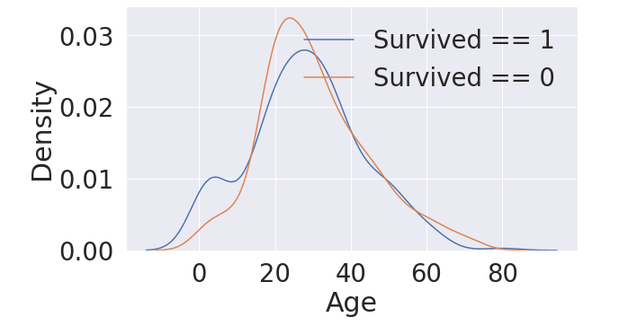
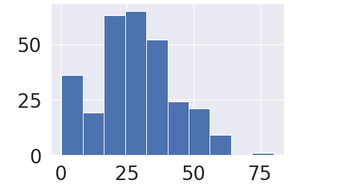
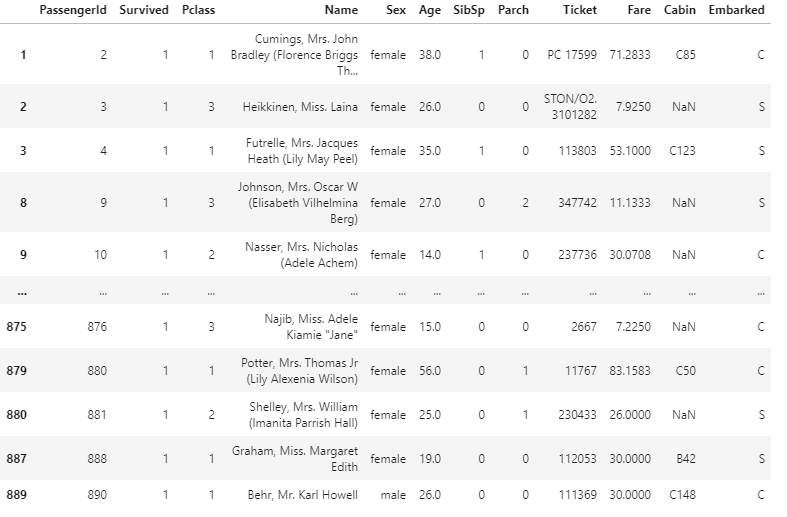
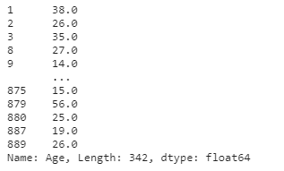
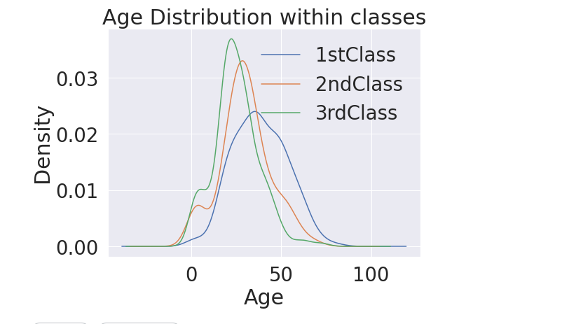
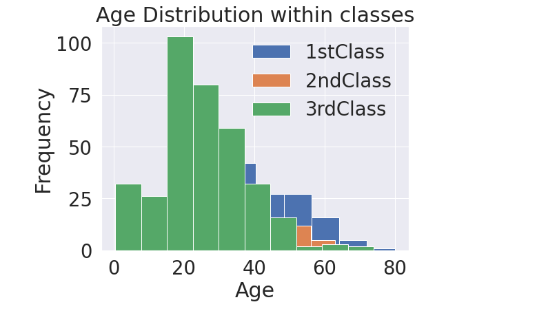
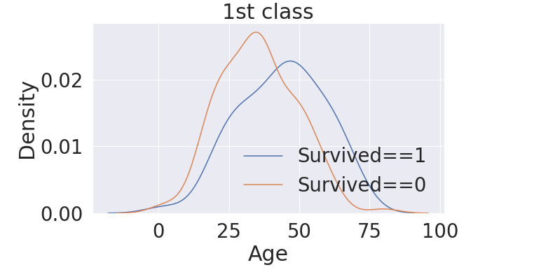
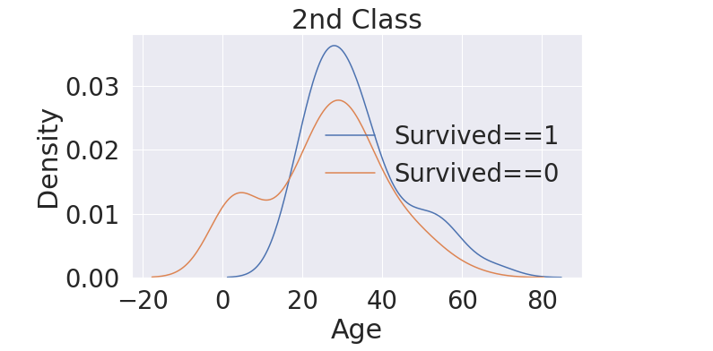
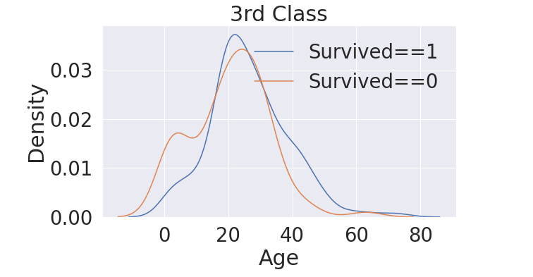
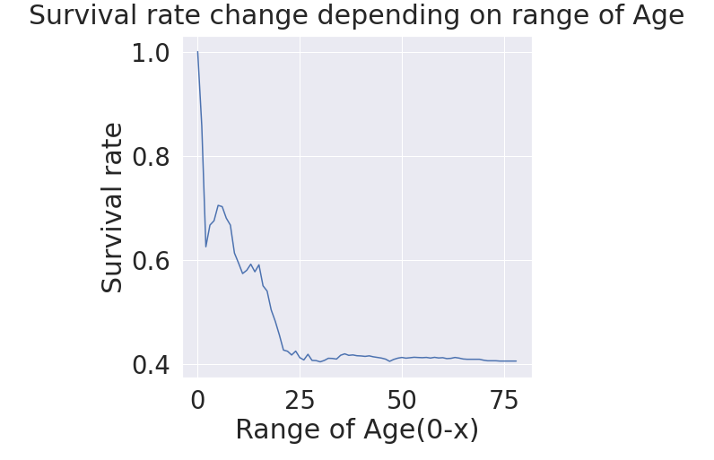

# 04. EDA - Age

> Age를 기준으로 생존율을 분석해보자.

### 탑승객 나이 분포 파악

```python
print('제일 나이 많은 탑승객: {:.1f} years'.format(df_train['Age'].max()))
print('제일 어린 탑승객: {:.1f} years'.format(df_train['Age'].min()))
print('탑승객 평균 나이:{:.1f} years'.format(df_train['Age'].mean()))
```

제일 나이 많은 탑승객: 80.0 years 

제일 어린 탑승객: 0.4 years 

탑승객 평균 나이:29.7 years

### 생존 여부에 따른 Age histogram

나이 구간에 따라, 생존율(density)를 나타내는 histogram을 plot해보자. 그런데, 여기서 우리는 seaborn의  `kdeplot`을 사용했다! 

##### KDE(kernel density estimate) 

히스토그램과 유사한 것으로, dataset의 분포를 나타낸다. 연속적인 확률 밀도 곡선을 사용해서 나타낸다.

즉, 히스토그램을 이어서 그렸다고 생각하면 될듯..!

```python
fig, ax =plt.subplots(1,1,figsize=(9,5))
sns.kdeplot(df_train[df_train['Survived'] == 1]['Age'],ax=ax)
sns.kdeplot(df_train[df_train['Survived'] == 0]['Age'],ax=ax)
plt.legend(['Survived == 1', 'Survived == 0'])
plt.show()
```



생존자들의 나이 분포가 어린 나이 쪽에 많음을 파악할 수 있다!

```python
#히스토그램을 타나태는 코드
df_train[df_train['Survived'] == 1]['Age'].hist()
```



전체 생존자들의 나이분포를 히스토그램으로 나타내면 다음과 같다. 위에서 그린 kde와 유사하게 20~40세 구간에 많은 인원이 존재하는 것을 알 수 있다.

```python
(df_train[df_train['Survived']==1])
(df_train[df_train['Survived']==1]['Age'])
```



첫번째 코드 실행시에는, 생존자들의 모든 정보가 추출되고, `['Age']`를 통해서 나이에 해당하는 col만 가져온다



### Age Distribution within Classes

> 한개를 분석하면,,, 이전에 했떤 녀석이랑,,엮어서,,같이 분석해보는거지,,

```python
plt.figure(figsize=(8,6))
df_train['Age'][df_train['Pclass'] == 1].plot(kind='kde') #seaborn.kdeplot 과 동일하다
df_train['Age'][df_train['Pclass'] == 2].plot(kind='kde')
df_train['Age'][df_train['Pclass'] == 3].plot(kind='kde')

plt.xlabel('Age') #axis로 설정하면 문법이 set x label이런식으로 변형된다.
plt.title('Age Distribution within classes')
plt.legend(['1stClass','2ndClass','3rdClass'])
```

위에서는 kde plot을 `sns.kdeplot`으로 그렸지만, `plot(kind='kde')` 방법으로도 사용이 가능하다.

각각의 class에 따른 age의 분포를 나타내었다.



class가 높을수록(여기서 숫자는 작아짐을 의미), 탑승 연령대가 높아진다. 역시, 비싸고 좋은것은 돈많은 으르신들이 타는것이지..

:bulb: Hist대신에 KDE를 사용하는 이유!

KDE 사용이유는, 이처럼 여러 데이터를 처리하는경우에 그 특성이 잘 나타난다! 

```python
#hist대신 kde를 사용하는 이유 => 겹쳐서 안보인다.
plt.figure(figsize=(8,6))
df_train['Age'][df_train['Pclass'] == 1].plot(kind='hist')
df_train['Age'][df_train['Pclass'] == 2].plot(kind='hist')
df_train['Age'][df_train['Pclass'] == 3].plot(kind='hist')

plt.xlabel('Age') #axis로 설정하면 문법이 set x label이런식으로 변형된다.
plt.title('Age Distribution within classes')
plt.legend(['1stClass','2ndClass','3rdClass'])
```



같은 데이터를 HIST로 나타내게 되면, 겹치는 구간은 데이터가 보이지 않는다! 그렇기 때문에, KDE를 사용한다

#### 개별 CLASS에서 Age에 따른 생존확률 분포 구하기

:panda_face: 여기서 내가 강의를 들으면서 pandas bullin..?을 사용하는 것 같다고 적어놓았는데 잘 모르겠어서(사실 강의 들은지 한~참 후에 정리함 ㅋㅅㅋ 역시 공부는 바로바로!) 추가로 정리해야 될 것 같다!

1. 1st Class

   ```python
   fig,ax = plt.subplots(1,1,figsize=(9,5))
   sns.kdeplot(df_train[(df_train['Survived']==0 )& (df_train['Pclass']==1)]['Age'],ax=ax)
   sns.kdeplot(df_train[(df_train['Survived']==1)& (df_train['Pclass']==1)]['Age'],ax=ax)
   plt.legend(['Survived==1','Survived==0'])
   plt.title('1st class')
   plt.show()
   ```

   `&` : and를 통해서 생존 여부와, 주어진 class를 공통으로 가지는 데이터들을 얻어서 plot

   

2. 2nd Class

   ```python
   #2등칸
   fig,ax = plt.subplots(1,1,figsize=(9,5))
   sns.kdeplot(df_train[(df_train['Survived']==0 )& (df_train['Pclass']==2)]['Age'],ax=ax)
   sns.kdeplot(df_train[(df_train['Survived']==1)& (df_train['Pclass']==2)]['Age'],ax=ax)
   plt.legend(['Survived==1','Survived==0'])
   plt.title('2nd Class')
   plt.show()
   ```



3. 3rd Class

   ```python
   #3등칸
   fig,ax = plt.subplots(1,1,figsize=(9,5))
   sns.kdeplot(df_train[(df_train['Survived']==0 )& (df_train['Pclass']==3)]['Age'],ax=ax)
   sns.kdeplot(df_train[(df_train['Survived']==1)& (df_train['Pclass']==3)]['Age'],ax=ax)
   plt.legend(['Survived==1','Survived==0'])
   plt.title('3rd Class')
   plt.show()
   ```

   

확실히 class가 낮아질 수록, 나이 분포가 전체적으로 어려진다. 1st Class는 탑승 연령자체가 높아서, 생존률도 나이가 높은 구간에서 높게 나타났다. 다른 class의 경우는 어릴수록, 생존율이 높게 나타났다. (근데 사망률도)


### Survival rate change depending on range of Age

실제 생존율이 나이가 낮을 수록, 높은지 확인하기 위해 누적합을 이용해서 구하자.

```python
#실제 생존율이 나이가 낮을 수록 높은지 확인하기 위해서
change_age_range_survival_ratio = []
for i in range(1,80):
    change_age_range_survival_ratio.append(df_train[df_train['Age']<i]['Survived'].sum()/len(df_train[df_train['Age']<i]['Survived']))
plt.figure(figsize=(7,7))
plt.plot(change_age_range_survival_ratio)
plt.title('Survival rate change depending on range of Age',y=1.02) #y는 제목의 위치를 옮겨줄려고
plt.ylabel('Survival rate')
plt.xlabel('Range of Age(0-x)')
plt.show()
```



#### :star: 확실히, 나이가 어릴수록 생존율이 급격하게 높다.. ! 이를 통해 우리는 생존율에 나이가 중요한 영향을 미친다는 것을 파악할 수 있다.

코드를 분석해보자면, 

```python
i = 10
df_train[df_train['Age']<i]['Survived'].sum()/len(df_train[df_train['Age']<i]['Survived'])
```

이 경우에 10살보다 어린애들중에서 `Survived` col의 모든 값들을 합치게 되면 산 친구들만 1의 값을 가지게 된다. 그리고, 총 10살 미만의 아동 수를 나눠주면 생존율이 구해지게 되는 코드이다!