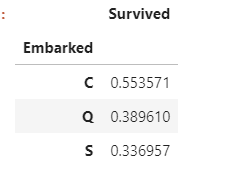
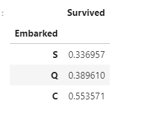
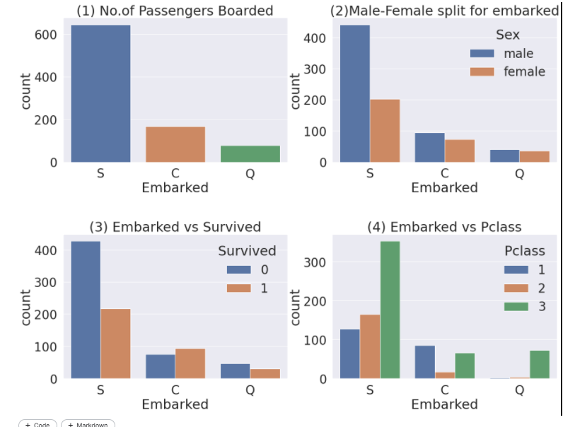

# 05.EDA-Embarked

> 엥..모야...tistory바뀌었네? 백만년만의 타이타닉 ^6^,, 난 나태한 내자신에게 그래도 까먹지 않아서 다행이라고 칭찬해줘야겠다^^,,

들어가기 앞서서 이번 eda부터는 뭔가 이제 예전 분석들을 통해서, 우리으ㅣ 가설? 이 맞았던걸 확인할 수 있어어 매우 기뻤다!

### 1. Embarked 생존율
```python
f,ax = plt.subplots(1,1,figsize=(7,7))
df_train[['Embarked','Survived']].groupby(['Embarked'],as_index=True).mean().sort_values(by='Survived',ascending=False).plot.bar(ax=ax)
```


C가 가장 높은 생존율을 보인다, 하지만 큰 차이를 주는 것 같지는 않아보인다. 사소한 차이라도 학습에 적용시키면 높은 예측율을 얻는데 좋겠지?!

- `sort_values`

  sort_values를 하면, 뒤에 정해주는 기준 value에 따라서 정렬이 된다(오름차순이 default)

  ```python
  #sort_values없이
  df_train[['Embarked','Survived']].groupby(['Embarked'], as_index=True).mean()
  ```

  

```python
#sort_values 적용
df_train[['Embarked','Survived']].groupby(['Embarked'], as_index=True).mean().sort_values(by='Survived')
# 생존율이 낮은 순서대로 정렬해준다 (sort_values는 즉, value가 낮은 순서대로 오름차순 정렬이 기본!)
```




## matrix구조로 여러가지 그래프 나타내기

> sex, class등등의 상관 관계를 한눈에 파악이 가능!

```python
#2,2로 하면 행렬처럼 한번에 여러 그래프를 보여줄 수 있따 !
#탑승자 수
f,ax = plt.subplots(2,2,figsize=(20,15))
sns.countplot('Embarked',data=df_train,ax=ax[0,0])
ax[0,0].set_title('(1) No.of Passengers Boarded')

#탑승자 성별
sns.countplot('Embarked',hue='Sex',data=df_train, ax=ax[0,1])
ax[0,1].set_title('(2)Male-Female split for embarked')

#생존율
sns.countplot('Embarked',hue='Survived',data=df_train, ax=ax[1,0])
ax[1,0].set_title('(3) Embarked vs Survived')

#class
sns.countplot('Embarked',hue='Pclass',data=df_train, ax=ax[1,1])
ax[1,1].set_title('(4) Embarked vs Pclass')

#간격조절
plt.subplots_adjust(wspace=0.2, hspace=0.5)
plt.show()
# wspace = subplot사이의 가로 간격
#hspace = 는 각 plot간의 간격!!
```

- f,ax = plt.subplots(2,2)에서 2,2로하면 2*2 행렬 구조로 그래프를 나타낼 수 있다!

1. Embarked별 탑승자 수를 구하는 그래프

   S의 탑승자수가 압도적으로 많다

2. 각 Embarked별 성별의 비

   => 우리가 지난번 분석에서, 여성의 비율이 높을 수록 생존율이 높다고 구했었다. 여기서 C,Q에서 여성의 비율이 높은 것을 파악이 가능하다.

3. Embarked별 생존율의 비 

   => 여성의 비율이 높은 C,Q에서 역시 생존율이 높게 나왔다! 이로써 여성의 비율이 높으면 생존율이 높다는 것을 확인이 가능했다.

4. Embarked별 Class

   => 기존의 분석에서는 class가 높을 수록 생존율이 높다는 것을 구했다. 4번 그래프에서 C에서 class 1의 비율이 매우 높은 것을 확인할 수 있다. 그런데, c에서 생존율이 가장 높게나왔으므로 생존율, 성별, 클래스간의 관계를 검증할 수 있다. 

