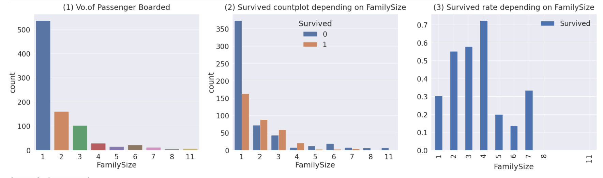

# 07. EDA - Family Size

> 이제,, EDA의 거의 마지막! 

FamilySize = SibSp+Parch로 이루어진 데이터를 우리가 추가해주는 것이다. 

SibSp = Siblings + spouse로 즉, 형제 자매 + 배우자

Parch = Parent + Children 으로 부모, 자식을 포함한다. 마지막으로 본인을 포함해야 하므로, 1을 더해준다!

## 1. FamilySize 컬럼 추가하기
```python
df_train['FamilySize'] = df_train['SibSp'] + df_train['Parch'] + 1
```

최대 가족 크기, 최소 가족 크기 구하기
```python
print('Maxium size of Fasmily:', df_train['FamilySize'].max())
print('Minimum size of Family:', df_train['FamilySize'].min())
```

이때, 최대 가족은 11명, 최소 가족은 1명으로 나온다.

마지막으로는 총 3개의 그래프를 통해, 생존율과 가족 크기의 연관성을 알아보자

## 2. Family Size vs Survived

```python
f,ax = plt.subplots(1,3,figsize=(40,10))
sns.countplot('FamilySize',data=df_train,ax=ax[0])
ax[0].set_title('(1) Vo.of Passenger Boarded', y=1.02)

sns.countplot('FamilySize',hue='Survived', data=df_train, ax=ax[1])
ax[1].set_title('(2) Survived countplot depending on FamilySize', y=1.02)

df_train[['FamilySize','Survived']].groupby(['FamilySize'],as_index=True).mean().sort_values(by='Survived').plot.bar(ax=ax[2])
ax[2].set_title('(3) Survived rate depending on FamilySize',y=1.02)
#왜 정렬된 순서로 안나오지..
plt.subplots_adjust(wspace=0.2,hspace=0.5)
plt.show()
```

1. 우선 첫번째 그래프를 통해서는 해당하는 size의 가족이 얼마나 탑승했는지를 파악했다. 대형 가족끼리도 꽤 탑승했음을 알 수 있다.
2. 이제 가족의 크기에 따라서 생존자 vs 사망자를 나타내는 그래프를 나타냈다.. 가족이 너무 큰 경우(8명 이상), 전원 사망하였고 2~4명의 가족들에서 생존율이 높게 나왔음을 알 수 있다.
3. 마지막으로, 생존율을 원래는 정렬형식으로 나와야하는데,, 이상하게 저렇게 정렬이 되지 않는다 ( data 만 출력시에는 정렬 됨,, 왜지)
	특히4인가족에서 압도적으로 높은 생존율이 나온 것을 확인 할 수 있다. 

