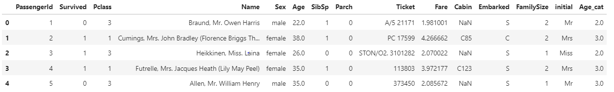

## Embarked 채우기

```
df_train['Embarked'].isnull().sum()
```

Embarked 항목의 빈 데이터 개수는 2개뿐이다. 이럴땐 최대 빈출값을 적용시키는 것이 편하다.  
우리는 EDA를 통해서 'S'가 최대 빈출 값임을 도출해냈다.  
그리고, 빈 데이터의 위치를 직접 찾아낼 필요없이 pandas에서 제공하는 기능을 사용하자 `fillna`

```
df_train['Embarked'].fillna('S',inplace=True)
```

fillna는 결측값을 채워주는 함수이다. inplace=True를 해줘야 실제 적용이 된다.  
그리고, 다시 isnull의 합이 0임을 통해, 모든 데이터가 채워졌음을 알 수 있다.

## Function으로 Feature engineering

9번 강의에서는 우리가 나이를 성에따라서 직접 적용시켜주는 하드 코딩을 했다 ㅠㅠ. 하지만 이번에서는 function을 이용한 방법과, 하드 코딩을 비교를 통해서 function의 편리한 방법을 익히도록 해보잣!

나이와 같은 continous data들은 category화를 통해서 진행하면 데이터의 손실등이 발생할 수 도 있다는 단점이 존재하지만, 장점도 존재한다.  
우리는 나이를 10단위로 끊어서 카테고리화를 하자

### 하드 코딩 모드

```
df_test.loc[df_test['Age'] < 10, 'Age_cat'] = 0
df_test.loc[(10<= df_test['Age']) & (df_test['Age'] <20), 'Age_cat'] = 1
df_test.loc[(20<= df_test['Age']) & (df_test['Age'] <30), 'Age_cat'] = 2
df_test.loc[(30<= df_test['Age']) & (df_test['Age'] <40), 'Age_cat'] = 3
df_test.loc[(40<= df_test['Age']) & (df_test['Age'] <50), 'Age_cat'] = 4
df_test.loc[(50<= df_test['Age']) & (df_test['Age'] <60), 'Age_cat'] = 5
df_test.loc[(60<= df_test['Age']) & (df_test['Age'] <70), 'Age_cat'] = 6
df_test.loc[(70<= df_test['Age']) ,'Age_cat'] = 7
```

이렇게 나이를 10단위로 짤라주고, category화를 통해 `Age_cat`이란 column이름에 저장하였다. 그리고 데이터를 확인해보면,




다음과 같이 만들어 진것을 확인할 수 있다.  
이거를 test에도 다 적용해줘야 하는 엄청난 하드코딩,,

### Funciton 사용

function을 만들고 그것을 apply기능을 통해 적용시켜주는 쉬운 방법이다.

```
def category_age(x):
    if x< 10:
        return 0
    elif x <20 :
        return 1
    elif x <30:
        return 2
    elif x<40:
        return 3
    elif x<50: 
        return 4
    elif x <60:
        return 5
    elif x< 70:
        return 6
    else:
        return 7
```

category\_age라는 함수를 만들어준다.

```
  df_train['Age_cat_2']=df_train['Age'].apply(category_age)
```

lambda함수처럼 apply안에 적용시킬 함수를 적어주고, 그 앞에 사용할 데이터를 설정해준다. 그리고 중복되지 않게 함수 방식으로 만든 카테고리는 `Age_cat_2`라는 이름으로 구분되게 생성한다.

`Age_cat_2`와 `Age_cat`이 동일한 값을 가지는지 확인해 주자.

```
  (df_train['Age_cat'] == df_train['Age_cat_2']).all()
```

여기서 all이란 함수는 하나라도 다른 값이 존재하면 False를 반환한다. 반대로, any()의 경우에는 다 False의 값을 가져야만, False를 반환한다.

두개의 column이 동일한지를 확인하였으니, drop이란 함수를 통해서 중복되는 column을 제거해주자

```
  df_train.drop(['Age', 'Age_cat_2'],axis=1,inplace=True)
df_test.drop(['Age'], axis=1, inplace = True)
```